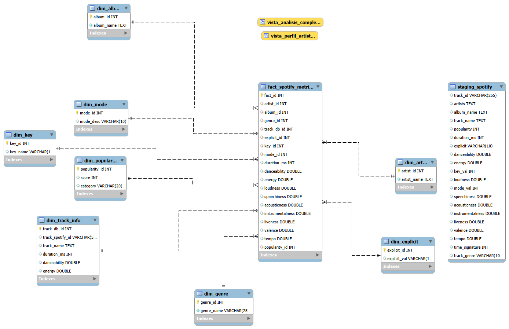

# Segundo proyecto Evolve Academy
Segundo proyecto realizado para el Máster de Data Science & IA de Evolve Academy. 
Proyecto de MySQL realizado en MySQL Workbench.

# Análisis de datos de Spotify con MySQL 🎵
Base de datos utilizada en este proyecto extraída de Kaggle:
[dataset](https://www.kaggle.com/datasets/maharshipandya/-spotify-tracks-dataset)
## Descripción
Proyecto completo de ingeniería de datos y análisis exploratorio (EDA) utilizando MySQL. Se ha transformado un dataset crudo en un modelo de estrella (Star Schema) normalizado.

## Estructura del Proyecto
- 01_spotify_schema.sql - Creación de la base de datos, creación e la tabla principal (fact_table) y de las 8 tablas de dimensiones (dim_table).
- 02_spotify_data.sql y 02.1_spotify_data.sql  — Carga de datos y limpieza. Establecimiento de relaciones PK (Primary Key), FK (Foreign Key) y constraints.
- 03_eda.sql — Consultas, funciones, vistas y conclusiones.

## Diagrama E-R del modelo

