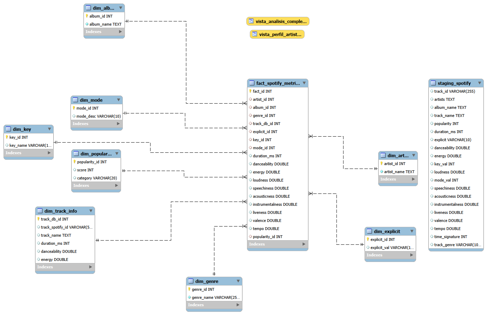

# Segundo proyecto Evolve Academy
Segundo proyecto realizado para el Máster de Data Science & IA de Evolve Academy. 
Proyecto de MySQL realizado en MySQL Workbench.

# Análisis de datos de Spotify con MySQL 🎵
Base de datos utilizada en este proyecto extraída de Kaggle:
[dataset](https://www.kaggle.com/datasets/maharshipandya/-spotify-tracks-dataset)
## Descripción
Este proyecto consiste en el diseño, implementación y explotación de una base de datos relacional en **MySQL** para analizar un dataset musical de Spotify con unos 114.000 registros.

El objetivo principal ha sido transformar datos crudos en información de valor siguiendo un flujo de trabajo profesional, desde la obtención y limpieza, pasando por el modelado de datos, hasta el análisis avanzado (EDA) para sacar algunas conclusiones relacionadas con el dataset.

## Estructura del Proyecto
- 01_spotify_schema.sql - Creación de la base de datos, creación e la tabla principal (fact_table) y de las 8 tablas de dimensiones (dim_table).
- 02_spotify_data.sql y 02.1_spotify_data.sql  — Carga de datos y limpieza. Establecimiento de relaciones PK (Primary Key), FK (Foreign Key) y constraints.
- 03_eda.sql — Consultas, funciones, vistas y conclusiones.

## Diagrama E-R del modelo

